  

# Pomodle

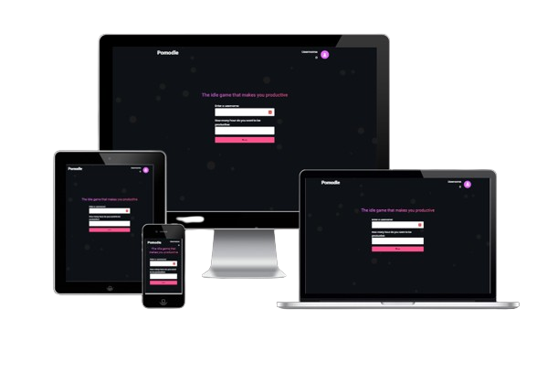

Pomodle is your ultimate productivity companion, where focus meets fun. This innovative Pomodoro timer combines a sleek, easy-to-use interface with an engaging idle game, making staying on task a delightful experience. Whether you're a student, professional, or simply looking to boost your productivity, Pomodle provides a distraction-free environment to help you power through tasks. With its intuitive design, customizable settings, and rewarding gameplay elements, Pomodle turns productivity into a game, making it easy to stay motivated and achieve your goals.

  

## [Click to view the live website](https://p-harting.github.io/pomodle/)

  

## Contents

* [Project Rationale](#project-rationale)

* [UX](#ux)

* [Wireframes](#wireframes)

* [Landingpage](#landingpage)

* [Events Page](#events-page)

* [Drinks Page](#drinks-page)

* [Contact Page](#contact-page)

* [Color Palette](#color-palette)

* [Fonts](#fonts)

* [Features](#features)

* [Responsive Design](#responsive-design)

* [Testing](#testing)

* [Manual Testing](#manual-testing)

* [Functional Testing](#functional-testing)

* [Validator Testing](#validator-testing)

* [Accessibility Testing](#accessibility-testing)

* [Bugs](#bugs)

* [Deployment](#deployment)

* [Credits](#credits)

* [Acknowledgments](#acknowledgments)

  

## Project Rationale

Pomodle, a fusion of Pomodoro timer and idle game, was designed to revolutionize the way we approach productivity. The project's core inspiration stems from the need to make staying focused and motivated an enjoyable and rewarding experience.

  

### Key Project Goals:

-  **Gamifying Productivity:** The primary objective is to create an engaging platform that leverages the psychological aspects of gameplay to boost user productivity, making it easier to stay on task and achieve goals.

-  **Enhancing User Experience:** By incorporating features such as a customizable task name, task history, and a relaxing music player with self-made lofi songs, Pomodle aims to create a distraction-free environment that helps users stay engaged and motivated.

-  **Providing a Fun Incentive:** The item shop feature adds a fun layer of reward and accomplishment, giving users a sense of achievement as they complete tasks and unlock new items.

  

### Target Audience:

The target audience for the Local Bar website comprises:

-  **Students and Academics:** Individuals seeking to optimize their study habits, manage assignments, and stay focused during long study sessions.

-  **Professionals and Entrepreneurs:** Busy individuals looking to enhance their productivity, prioritize tasks, and stay motivated in fast-paced work environments.

-  **Creative Minds and Hobbyists:** Artists, writers, and creatives who need a tool to help them stay engaged and inspired during long periods of focused work.

  

By catering to the needs of these groups, Pomodle aims to become an indispensable productivity companion, helping users achieve their goals while making the experience enjoyable and rewarding.

  

## UX

Wireframes were meticulously crafted using [Figma](https://www.figma.com/), leveraging its versatile design capabilities and collaborative features.

  

The color palette was thoughtfully created using [Canva](https://www.canva.com/), to create a calming and focused atmosphere, perfect for productivity. The modern color palette was thoughtfully selected to evoke a sense of serenity and motivation. The typography and layout were designed to be clean, intuitive, and easy to navigate, ensuring that users can stay focused on their tasks without distraction.

  

### Wireframes

  

Wireframes played a crucial role in the development of Pomodle, providing a visual guide for the layout and structure of each webpage. They served as blueprints, outlining the placement of key elements such as the login form, Pomodoro timer, shop interface, music player, and task management sections.

  

For Pomodle, wireframes were meticulously crafted to ensure an intuitive and user-friendly interface across all devices. Each wireframe represents a unique page, from the login page to the Pomodoro timer and shop interfaces, ensuring a seamless user experience.

#### Login Page

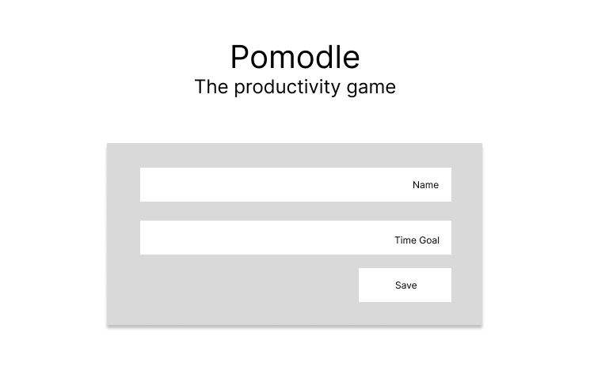

#### Main Page

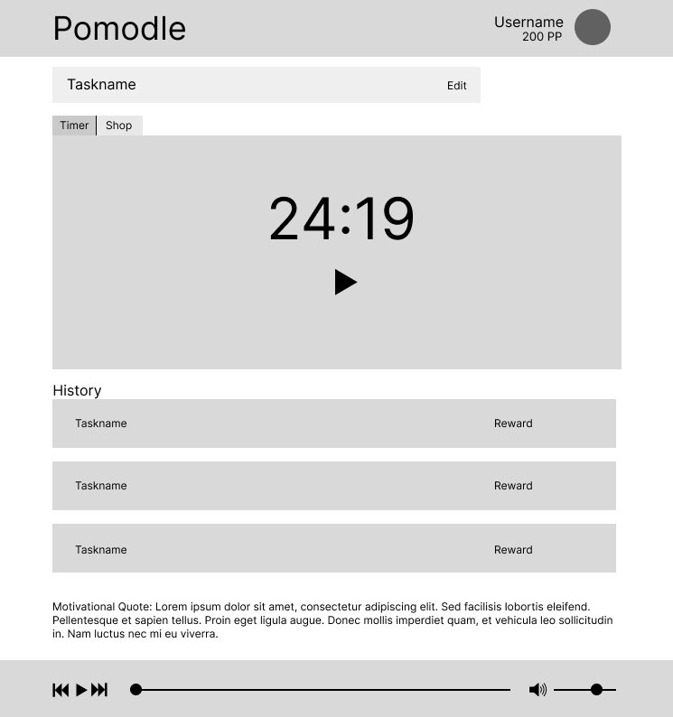

#### Audio Player

  

### Color Palette

For Pomodle, a vibrant and engaging color palette has been carefully selected to evoke the energy and motivation of a productive workspace.

- Dark Gray: #0e1217 The dark gray tone serves as a neutral background, providing a clean and modern foundation for the application. This color choice represents stability and sophistication, setting the tone for a focused and productive environment.

- Purple: #E669FB The vibrant purple hue is used as an accent color, adding a touch of creativity and playfulness to the interface. This color choice inspires motivation and energy, encouraging users to stay engaged and motivated.

- Pink: #fc538d The pink tone is used to add a pop of color and visual interest to the application. This color choice represents enthusiasm and excitement, injecting a sense of fun and enjoyment into the Pomodoro timer experience.

In essence, this color palette reflects the dynamic and engaging nature of Pomodle, where users can stay focused, motivated, and productive in a fun and interactive environment.

  

### Fonts

For Pomodle, I've incorporated Roboto and Poppins fonts sourced from Google Fonts. The font sizes are dynamically adjusted for responsive design.

- Roboto is employed for its clean and modern aesthetic, used for body text and interface elements.

- Poppins is utilized for headings and titles, providing a bold and attention-grabbing contrast to the Roboto font.

Both fonts are imported from Google Fonts, ensuring a consistent and visually appealing typography throughout the application.

  
## Features

### Login Page

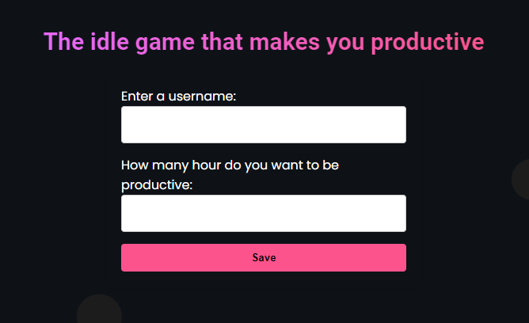

-   A clean and simple login page where users can enter their username and set a daily goal, making it easy to get started with Pomodle.

### Pomodoro Timer

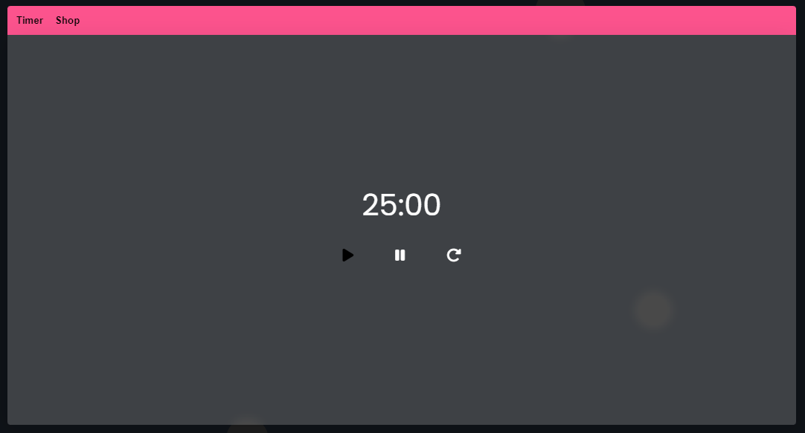

-   A sleek and intuitive Pomodoro timer that helps users stay focused and on track, with customizable task names to fit their specific needs and goals.

### Shop

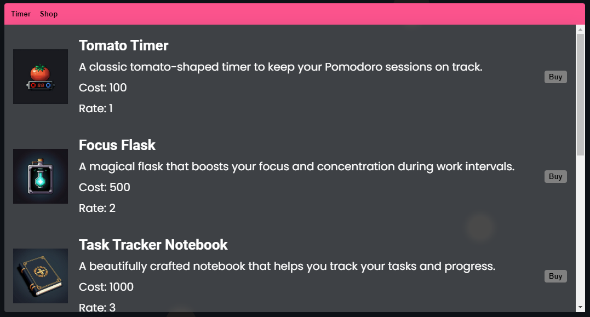

-   A fun and engaging shop where users can browse and purchase idle items to enhance their Pomodoro experience.

### Task History

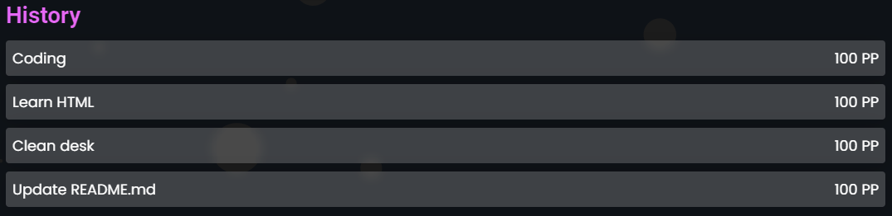

-   A convenient task history feature that allows users to track their progress and stay motivated, providing a clear and concise overview of completed tasks.

### Help Section

-   A comprehensive help section that provides users with a step-by-step guide on how to use Pomodle, ensuring a seamless experience.

### Audio Player

-   A built-in audio player featuring self-made lofi songs, designed to help users relax and stay focused during their Pomodoro sessions.

### Editable Task Name

-   Users can easily name their tasks to fit their needs, making it easy to stay organized and focused.

### Timer Controls

-   Users can pause the timer when needed, and resume when they're ready to refocus, or reset the timer to start fresh when they're ready to start a new Pomodoro session.

### Motivation Quote Section

-   A daily dose of motivation in the API-powered quote section, providing users with a new quote every session to keep them inspired and motivated.

### Navigation Bar

-   The navigation bar displays the user's username and productivity points, tracking their progress and providing a clear view of their accomplishments.

### Features to implement in the future

## Responsive Design
- **Optimized Images:** All images on Pomodle are optimized for fast loading times, ensuring a smooth experience across various devices and screen sizes.
- **Flexbox Layout:** The website extensively uses Flexbox to dynamically arrange elements, making optimal use of available space and maintaining a clean, organized look.
- **Responsive Text:** Text size and spacing are calculated responsively, adjusting based on screen size and resolution to ensure readability and visual appeal on any device.
- **Strategic Media Queries:** Media queries are strategically implemented to adapt the layout and design elements for different screen sizes, ensuring a consistent and user-friendly experience across desktops, tablets, and mobile devices.
## Testing
### Manual Testing
For a thorough evaluation of the website's functionality, I conducted a series of manual tests across various platforms and devices. 

- **Desktop Testing:** Verified compatibility using Chrome, Firefox, and Edge browsers on a Windows computer.
- **Mobile Testing (Android):** Ensured responsiveness and functionality with Chrome and Firefox browsers on an Android device.
- **Mobile Testing (iOS):** Tested compatibility and performance using Safari on an iOS device.
- **User Feedback:** Solicited input from multiple users to assess website functionality across different devices and gather valuable feedback on user experience.
- **Link Verification:** Manually inspected all internal and external links to ensure they direct users accurately.
- **Input Validation:** Confirmed that the inputs work as intended, requiring valid inputs for submission.

These rigorous tests ensure a seamless user experience across various platforms and devices.
### Functional Testing
| Action                                                                                   | Expected Behavior                                                                      | Passed or Failed |
|------------------------------------------------------------------------------------------|----------------------------------------------------------------------------------------|------------------|
| Fill out the login form with valid username (1-12 characters, no spaces) and goal (1-24 characters) | The login button should be enabled and the login process should proceed successfully    | Passed           |
| Fill out the login form with invalid username (less than 1 character or more than 12 characters) | An error message should be displayed indicating invalid username                        | Passed           |
| Fill out the login form with invalid goal (less than 1 character or more than 24 characters) | An error message should be displayed indicating invalid goal                            | Passed           |
| Fill out the login form with valid username and invalid goal                             | An error message should be displayed indicating invalid goal                            | Passed           |
| Fill out the login form with invalid username and valid goal                             | An error message should be displayed indicating invalid username                        | Passed           |
| Click on the "Buy" button in the shop to purchase an item                                | The item should be added to local storage and the rate increased         | Passed           |
| Verify that prices increase when buying items in the shop                                | The prices of items in the shop should increase correctly                              | Passed           |
| Test the idle timer by leaving the page open for a set amount of time                    | The idle timer should trigger correctly and display a toast message to the user     | Passed           |
| Test the audio player by playing a song, pausing it, and then playing it again           | The audio player should play, pause, and play again correctly                          | Passed           |
| Test the audio player by skipping to the next and previous songs                         | The audio player should skip to the next and previous songs correctly                   | Passed           |
| Test the audio player by adjusting the volume                                            | The audio player should adjust the volume correctly                                    | Passed           |
| Click on the "Help" button to open the help popup                                        | The help popup should open correctly and display the help content                       | Passed           |
| Test the Pomodoro timer by starting, pausing, and resetting it                           | The Pomodoro timer should start, pause, and reset correctly                            | Passed           |

### Validator Testing
#### HTML
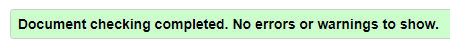
- No errors were detected on any page through the W3C HTML Validator.
#### CSS
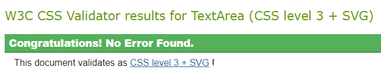
- The W3C CSS Validator found no errors in the stylesheet.
#### Jshint Testing
- The Jshint Validator found no significant issues.
#### Lighthouse
**Screenshot of the desktop test results of the main page:**

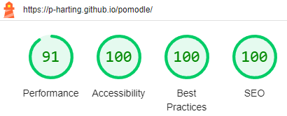

**Screenshot of the mobile test results of the main page:**

### Accessibility Testing
To ensure optimal accessibility for all users, extensive color contrast testing was conducted using the [Coolors Contrast Checker](https://coolors.co/). The following images illustrate the results of the color contrast tests:

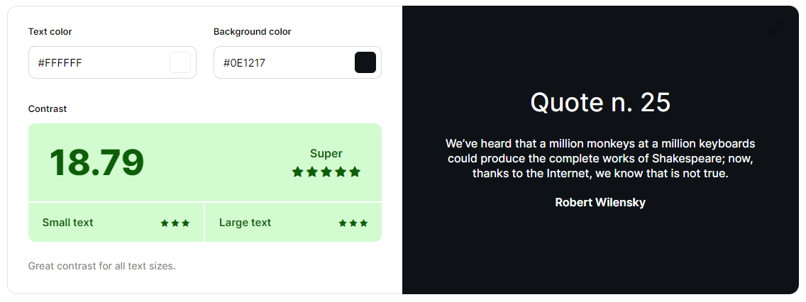

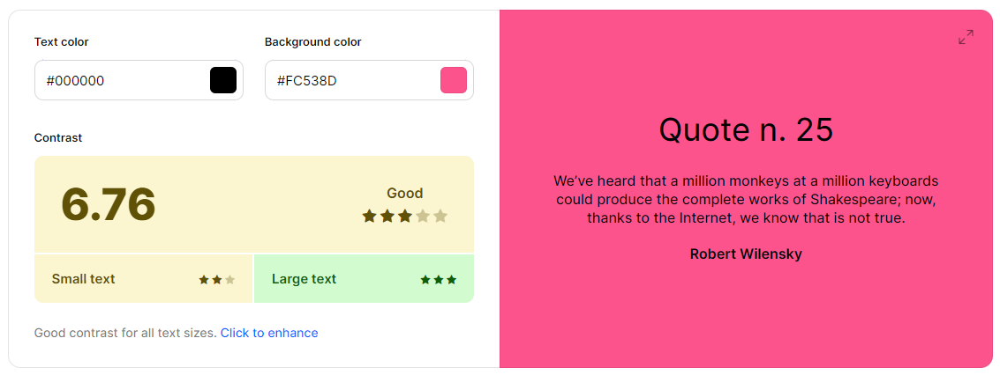

These tests aimed to verify that text elements across the website maintain sufficient contrast against their respective backgrounds, thus ensuring readability and usability for individuals with visual impairments.
### Bugs
- [✔] Pomodoro timer starting relax interval twice after being paused
## Deployment
### Deployment to GitHub Pages
This section should describe the process you went through to deploy the project to a hosting platform (e.g. GitHub)

-   The site was deployed to GitHub pages. The steps to deploy are as follows:
-   In the GitHub repository, navigate to the Settings tab
-   From the source section drop-down menu, select the Master Branch
-   Once the master branch has been selected, the page will be automatically refreshed with a detailed ribbon display to indicate the successful deployment.

The live link can be found here:  [https://p-harting.github.io/pomodle/](https://p-harting.github.io/pomodle/)

### Clone from Github
To clone this repository, follow these steps:
-   On the repository's GitHub page, click on the "Code" button.
-   In the dropdown, click on "Clone" to copy the repository's URL to your clipboard.
-   Open your terminal or Git Bash.
-   Navigate to the directory where you want to clone the repository.
-   Use the git clone command followed by the URL you copied earlier to clone the repository to your local machine.

### Fork from Github
To fork this repository, follow these steps:
-   On the repository's GitHub page, click on the "Fork" button at the top-right corner.
-   Once forked, the repository will be available under your GitHub account.

## Credits
